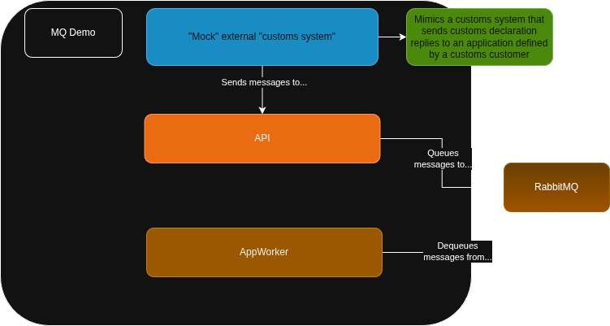

# MQMessaging sample project 

This is a sample project that i've made to learn more about MQ, especially with RabbitMQ.  

This is a simulated app hierarchy where the architecture & idea is the following:

The simulation is that a customs handling system sends and receives customs related data from a government service.  
The point of the queue here is that even though the government service in question uses a standardized JSON API contract,  
The endpoint that receives messages only queues the messages received.   
This way messages are less likely to miss delivery, since they are dequeued from a queue.

--ExternalMockApp - a very simple simulated "government system" that sends API messages to the MQClient

--MQClient - standard ASP.NET API that declares the rabbitmq topology and also services simulated API calls from a external system  
--MQCommon - standard contracts for the API and the app itself. This abstracts[text](about:blank#blocked) the rabbitmq usage in the main app.  
--MQWorkerApp - a simulated app that receives the queue messages from RabbitMQ and consumes them. Not really doing that much with the messages themselves since the idea is to just simulate and learn about RabbitMQ, so this is simply a demonstration of an use case with RabbitMQ.

Since this only focuses on the queue itself the client is not secure and there is no persistent data for the worker, just visible logging that the app receives messages...

# Running the demo  

Run the docker compose services (the only service there is the rabbitmq local instance)
Then also run the API, the mock message console client and the worker  

The API receives messages from the mock client that then is forwarded to the MQ, then the worker goes through this queue once messages arrive.
